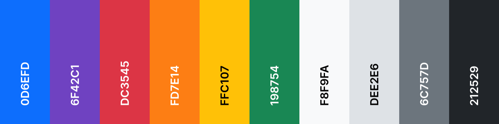

# GITeams

https://giteams.netlify.app

---
## Overview

GITeams is a fan-made Genshin Impact knowledge exchange platform which enables its users to share their recommended team builds in great detail.

### Users' Goals

To share their unique insights on team building and to gain insights from others.

### Organization's Goals

To be able to contribute to the Genshin Impact community by providing a communication tool specifically for the team building aspect of the game.

---

## UI/UX

### User Stories & Acceptance Criteria

| User Stories | Acceptance Criteria |
| ------------ | ------------------- |
| As a beginner of Genshin, I struggle with deciding which characters to invest my limited resources on to composite a robust team. I want to have a detailed team building guide containing information such as team composition, and the weapon and artifact sets good for each team member. | A website where users can find team building guides posted by other people in great detail. |
| As a casual Genshin player, I have issue defeating the boss Azhdaha by myself. My characters are relatively well built but I have no idea how to composite my team. | A website that enables users to search for good teams for a specific boss. |
| As a pro Genshin player, I have plenty of insights on the game mechanism and team building that may be helpful to beginners. I want to help more people in the community by sharing my knowledge. | A website that enables users to post their team builds in great detail. |

### Color

Bootstrap color scheme is used because it is diverse enough and visually appealing.

### Font

_HYWenHei-85W_ is used because it is the primary typeface of Genshin Impact, seen as the font which is used to display virtually everything in-game.

---

## Features

### Create

Create and post personalized team builds containing detailed information such as team name, team composition, recommended bosses, rotation guide, and customized notes.

### Read

Search for teams by team name, number of five-star characters, included characters, or target boss.

### Update

Update every piece of information of a team.

### Delete

Delete a team.

---

## Technologies Used

1. HTML
2. CSS
3. JavaScript
4. [MongoDB](https://www.mongodb.com/)
    - database
5. [Express](http://expressjs.com/)
    - API
6. [Heroku](https://www.heroku.com/)
    - API deployment
7. React
    - for single-page application
8. [Bootstrap 5.1](https://getbootstrap.com/docs/5.1/getting-started/introduction/)
    - for styling and responsiveness